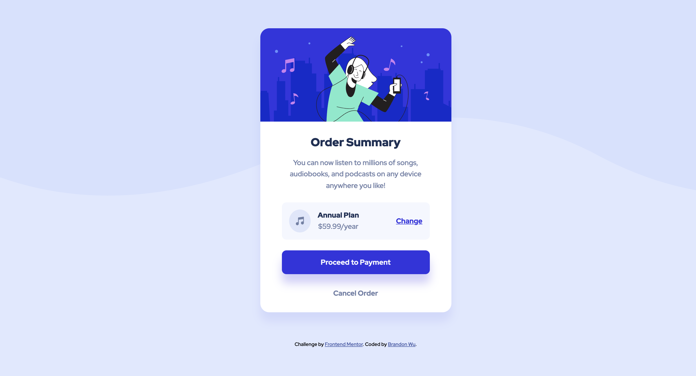

# Frontend Mentor - Order summary card solution

This is a solution to the [Order summary card challenge on Frontend Mentor](https://www.frontendmentor.io/challenges/order-summary-component-QlPmajDUj). Frontend Mentor challenges help you improve your coding skills by building realistic projects.

## Table of contents

- [Overview](#overview)
  - [The challenge](#the-challenge)
  - [Screenshot](#screenshot)
  - [Links](#links)
- [My process](#my-process)
  - [Built with](#built-with)
  - [What I learned](#what-i-learned)
- [Author](#author)

## Overview

### The challenge

Users should be able to:

- View the optimal layout depending on their device's screen size
- See hover states for interactive elements

### Screenshot

### Links

- Solution URL: [https://github.com/BrandonWu500/order-summary-component](https://github.com/BrandonWu500/order-summary-component)
- Live Site URL: [https://brandonwu500.github.io/order-summary-component/](https://brandonwu500.github.io/order-summary-component/)

## My process

### Built with

- Semantic HTML5 markup
- CSS custom properties
- Flexbox
- Mobile-first workflow

### What I learned

more practice with flexbox layouts and using "gap" feature

## Author

- Website - [Brandon Wu](https://github.com/BrandonWu500)
- Frontend Mentor - [@BrandonWu500](https://www.frontendmentor.io/profile/BrandonWu500)
